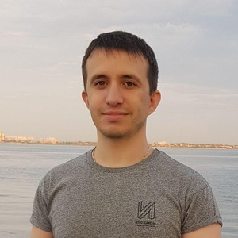

# Vova **Kusakin**

## 📞 Contacts

| :--- | :--- |
| telegram | [@kusakinvova](https://t.me/kusakinvova) |
| email | [kusakinvova@gmail.com](kusakinvova@gmail.com) |
| github | [KusakinVova](https://github.com/kusakinvova) |
| discord | KusakinVova (@kusakinvova) |

&nbsp;

## 📝 Summary

Full Stack Developer with over 10 years of experience in the IT industry.

Specializes in building and launching projects from scratch. Successfully refactored large-scale systems and implemented architectural improvements, increasing development speed by 30–50% and doubling the number of orders while maintaining performance and reliability.

Proficient in JavaScript, TypeScript, React, PHP, Node.js, and other technologies, consistently delivering high-quality, scalable solutions in fast-paced and dynamic environments.

&nbsp;

## 🧩 Skills

ReactJs, Next.js, Node.js, Redux, RTK Query, jQuery, TypeScript, HTML5, CSS3, Bootstrap, Materialize, SCSS(Sass), Vue, JavaScript, PHP(1С-Bitrix, Joomla, Drupal, Wordpress, Simpla, Symphony), MySQL, Python (Django), PostgreSql, Git, Mercurial(HG), Docker (Docker composer), Bash, LAMP, Webpack, Eslint, Socket.IO, REST API.

&nbsp;

## 👨‍💻 Experience

| :--- | :--- |
| 08.2022 — present | Front-end Developer   Extrachain |
| 04.2024 — 04.2025 | Full stack Developer   NDA |
| 04.2017 — 07.2022 | Full stack Developer   Teletrade |
| 07.2014 — 04.2017 | Full stack Developer   Freelance |
| 04.2013 — 06.2014 | Full stack Developer   Ltd STIB |
| 05.2012 — 03.2013 | Engineer of the department of automated technical processes   PJSC «AVDIIVKA COKE PLANT» |

&nbsp;

## 🤝 Volunteer Experience

| :--- | :--- |
| 2025 | **Education Mentor**   The Rolling Scopes School EPAM   Mentored four students through the "Front-end Development" course.   Responsibilities included code review, mock interviews, live coding sessions, and resume building assistance.   |

&nbsp;

## 🎓 Education

### Online learning

| :--- | :--- |
| 2021 | **JAVASCRIPT/FRONT-END**   The Rolling Scopes School EPAM |
| 2013 | **Bitrix Framework Developer**   Ltd "1C-Bitrix" |
| 2013 | **Basic CSS**   NOU "INTUIT" |
| 2010 | **Java Fundamental** Java Fundamental сourses powered by Sun Microsystems  DonNTU UNITECH |

### Higher education

| :--- | :--- |
| 2005 — 2011 | **Master's degree**   **University:** Donetsk National Technical University   **Faculty:** Computer Sciences and Technologies (CST)  **Department:** Automated Control Systems (ACS)  **Speciality:** Information Control Systems and Technologies (ICS) |

&nbsp;

## 📚 Languages

- English - B1/B2
- Russian - C2
- Ukrainian - C1
